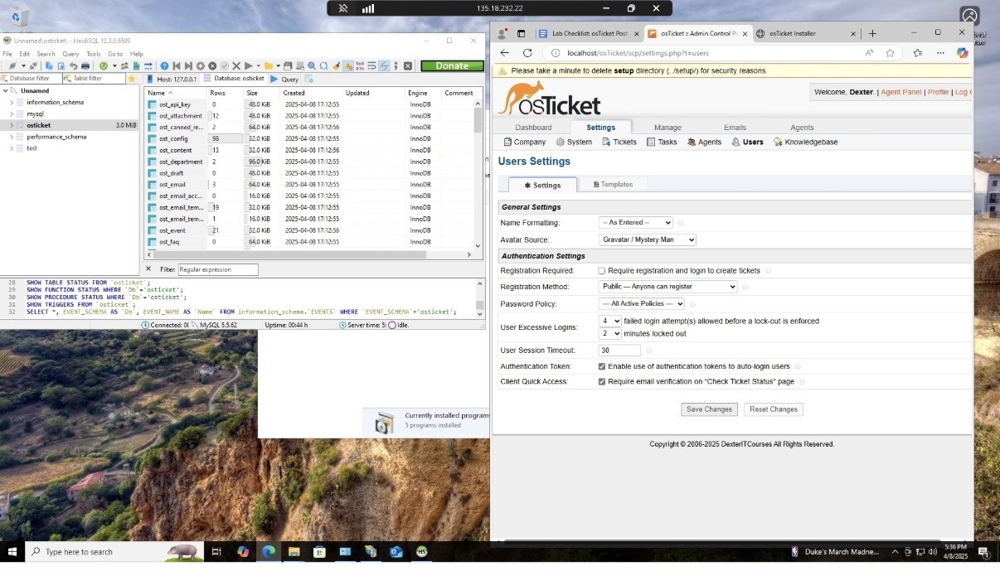
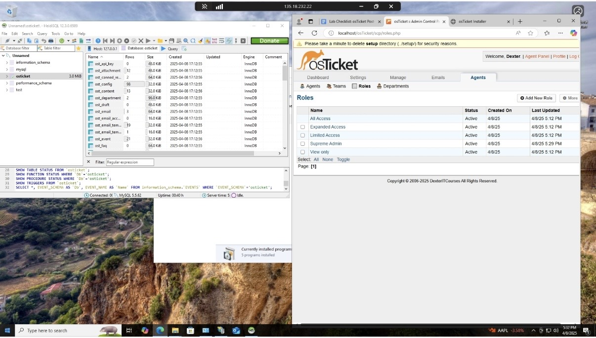
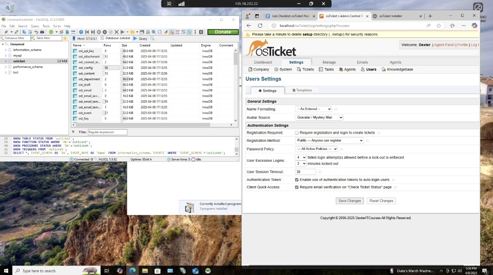
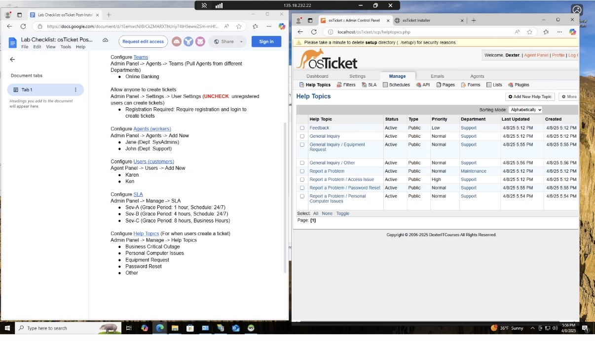
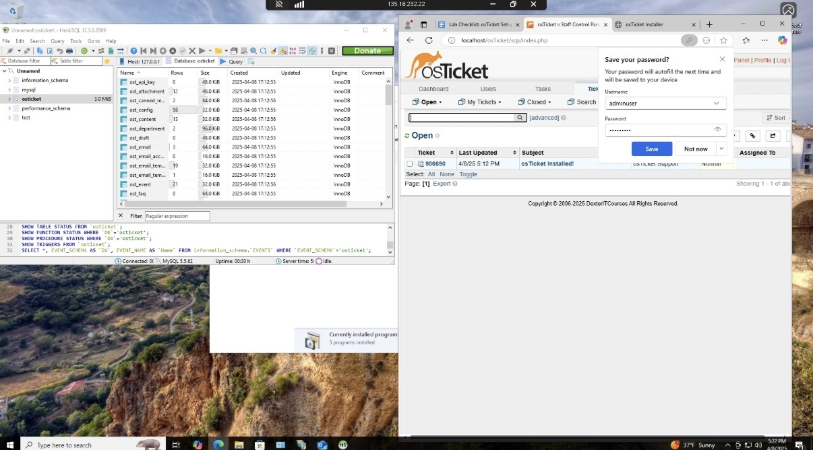
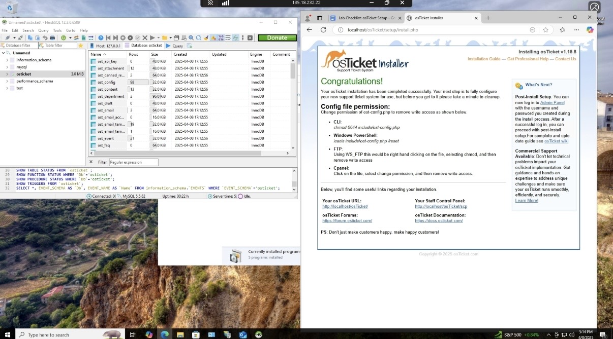

# osticket-prereqs

  

<h1>osTicket - Prerequisites and Installation</h1>

This project documents the installation and configuration of the open-source help desk ticketing system osTicket on a Windows 10 virtual machine using Microsoft Azure, Remote Desktop, and IIS.

<h2>Video Demonstration</h2>

- [YouTube: How To Install osTicket with Prerequisites](https://www.youtube.com)

<h2>Environments and Technologies Used</h2>

- Microsoft Azure (Virtual Machines/Compute)
- Remote Desktop
- Internet Information Services (IIS)
- MySQL / MariaDB
- HeidiSQL
- Windows 10 (21H2)

<h2>Operating Systems Used</h2>

- Windows 10 (21H2)

<h2>List of Prerequisites</h2>

- A Windows 10 virtual machine in Microsoft Azure
- Internet Information Services (IIS) enabled
- PHP installed and configured for osTicket
- MySQL database created for osTicket
- HeidiSQL installed to manage the database

<h2>Installation Steps</h2>

<h3>1. Prepare the database</h3>

I started by opening HeidiSQL and connecting to the local MySQL server. Then I created or selected the <strong>osTicket</strong> database and confirmed that the required tables were present after the setup process. This made sure the application had a working database before continuing with the web installation.

<h3>2. Complete the osTicket installer</h3>

Next, I used the osTicket web installer in the browser to finish the main installation. After the installation completed successfully, I reviewed the confirmation page and followed the file permission instructions to secure the setup.

<h3>3. Sign in to the staff control panel</h3>

After installation, I logged in to the osTicket staff control panel using the administrator account. This verified that the system was working properly and that the admin dashboard could be accessed without errors.

<h3>4. Configure user settings</h3>

I then opened the user settings area and reviewed the registration and authentication options. I adjusted the settings so the ticketing system matched the lab requirements and controlled how users could create accounts and submit tickets.

<h3>5. Review roles and permissions</h3>

Next, I checked the roles section to verify the different permission levels available for agents. This helped organize access for staff members and ensured the help desk structure was set up correctly.

<h3>6. Set up departments</h3>

After that, I moved to the departments section and confirmed that the support departments were created correctly. This allowed tickets to be routed to the right team, such as maintenance or support, based on the issue type.

<h3>7. Confirm help topics and final setup</h3>

Finally, I reviewed the help topics in the admin panel and verified that the system was ready for use. At this point, osTicket was fully installed, configured, and prepared to receive and manage support tickets.

